# ONDC Shopping MCP Backend

🛍️ Production-ready ONDC shopping backend with Model Context Protocol (MCP) integration for AI-powered conversational commerce.

## 🚀 Quick Start (5 minutes)

Get the entire system running with just a few commands:

```bash
# Clone the repository
git clone https://github.com/your-org/mcp-backend.git
cd mcp-backend

# Option 1: Interactive setup (recommended for first-time users)
make setup

# Option 2: Quick start (if you have API keys ready)
cp .env.example .env
# Edit .env and add your GEMINI_API_KEY and WIL_API_KEY
make quickstart

# Test the installation
curl http://localhost:8001/health
```

That's it! The system is now running with:
- ✅ API Server at http://localhost:8001
- ✅ Supervisor Web Interface at http://localhost:9001 (admin:supervisor2024)
- ✅ Vector search with Qdrant
- ✅ 94 products loaded and indexed
- ✅ Guest shopping enabled

### Prerequisites

You only need:
1. **Docker & Docker Compose** installed
2. **Gemini API Key** - [Get it free here](https://makersuite.google.com/app/apikey)
3. **Himira API Key** - Contact Himira or use test credentials

## 🏗️ Architecture Overview

This backend implements a complete ONDC (Open Network for Digital Commerce) shopping solution with AI assistance capabilities through MCP tools. It enables conversational shopping experiences where users can search, browse, add to cart, and complete purchases through natural language interactions.

### System Components

```
┌─────────────────────────────────────────────────────────────┐
│                    Frontend Application                      │
│                  (Web/Mobile/Chat Interface)                 │
└─────────────────┬───────────────────────────────────────────┘
                  │ HTTP/REST APIs
┌─────────────────▼───────────────────────────────────────────┐
│              API Server (Port 8001)                          │
│  • Chat API (/api/v1/chat) - Conversational interface        │
│  • Session Management - Persistent shopping sessions         │
│  • Cart APIs - Direct cart operations                       │
│  • Search API - Product discovery                           │
└─────────────────┬───────────────────────────────────────────┘
                  │ MCP Agent (Internal)
┌─────────────────▼───────────────────────────────────────────┐
│            MCP Server (STDIO Transport)                      │
│  • 40+ Shopping Tools                                        │
│  • Session Management Tools                                  │
│  • ONDC Protocol Tools (SELECT, INIT, CONFIRM)              │
│  • Cart & Order Management Tools                            │
└─────────────────┬───────────────────────────────────────────┘
                  │ API Calls
┌─────────────────▼───────────────────────────────────────────┐
│           Himira BIAP Backend (External)                     │
│  • ONDC Protocol Implementation                              │
│  • Network Gateway                                          │
│  • Order Processing                                         │
└─────────────────┬───────────────────────────────────────────┘
                  │ ONDC Protocol
┌─────────────────▼───────────────────────────────────────────┐
│                    ONDC Network                              │
│         (Sellers, Logistics, Payment Gateways)               │
└─────────────────────────────────────────────────────────────┘

┌─────────────────────────────────────────────────────────────┐
│           Supporting Services (Docker Compose)               │
├───────────────────────────────────────────────────────────────┤
│  • Qdrant (Port 6333) - Vector search for products          │
│  • ETL Pipeline - Data loader and embedding generator       │
│  • Supervisor - Process manager for API server              │
└─────────────────────────────────────────────────────────────┘
```

## 🔍 Under the Hood - How Services Work Together

### Service Architecture

| Service | Port | Purpose | Technology |
|---------|------|---------|------------|
| **API Server** | 8001 | REST API gateway, hosts Chat API, manages MCP agent | FastAPI + Python |
| **MCP Server** | STDIO | Shopping tools for AI operations | MCP Protocol + STDIO |
| **Qdrant** | 6333 | Vector database for semantic search | Qdrant Vector DB |
| **ETL Pipeline** | One-time | Loads products, generates embeddings | Python + Gemini API |
| **Himira Backend** | External | ONDC protocol implementation | Node.js (external) |

### Data Flow for Shopping Journey


### Core Services Explained

#### 1. **API Server** (`backend/api/server.py`)
- **Role**: Main entry point for all client interactions
- **Features**:
  - Chat API for conversational shopping
  - Session management with TTL
  - Rate limiting (20 req/min)
  - MCP agent integration
  - Direct cart and search APIs
- **Managed by**: Supervisor process manager

#### 2. **MCP Server** (`backend/ondc-shopping-mcp/`)
- **Role**: Provides shopping tools for AI agent
- **Communication**: STDIO transport (not HTTP)
- **Tools**: 40+ tools including:
  - Session management (initialize_shopping, get_session_info)
  - Product discovery (search_products, browse_categories)
  - Cart operations (add_to_cart, view_cart, update_cart)
  - ONDC checkout (select_items_for_order, initialize_order, confirm_order)
  - Order management (track_order, get_order_status)

#### 3. **Qdrant Vector Database**
- **Role**: Semantic product search
- **Collection**: `himira_products` (94 products with embeddings)
- **Embedding Model**: Gemini text-embedding-004 (768 dimensions)
- **Usage**: Enhanced search via MCP tools

#### 4. **ETL Pipeline**
- **Role**: One-time data initialization
- **Process**:
  1. Fetches products from Himira backend
  2. Generates embeddings using Gemini API
  3. Stores in Qdrant collection
- **Runs**: Once on `make init` or container startup

#### 5. **Himira BIAP Backend** (External)
- **URL**: https://hp-buyer-backend-preprod.himira.co.in
- **Role**: Actual ONDC protocol implementation
- **Authentication**: WIL_API_KEY header
- **Handles**: SELECT, INIT, CONFIRM, order tracking

## 🚀 Quick Start

### Prerequisites

- Docker and Docker Compose
- WIL API Key (for Himira backend access)
- (Optional) Gemini API key for vector search

### Installation

1. **Clone and setup**:
```bash
git clone <repository>
cd mcp-backend
cp .env.example .env
```

2. **Configure environment** (.env):
```env
# Required: Himira Backend Access
WIL_API_KEY=your_api_key_here
BACKEND_ENDPOINT=https://hp-buyer-backend-preprod.himira.co.in

# Guest User Configuration
GUEST_USER_ID=guestUser
GUEST_DEVICE_ID=d58dc5e2119ae5430b9321602618c878

# Optional: Vector Search
GEMINI_API_KEY=your_gemini_key_here
VECTOR_SEARCH_ENABLED=false
```

3. **Start services**:
```bash
make up        # Start all services
make logs      # View logs
make status    # Check health
```

## 📚 Complete API Documentation

### Base URL
```
http://localhost:8001
```

### Service Endpoints Map

| Endpoint | Method | Service | Description |
|----------|--------|---------|-------------|
| `/` | GET | API Server | API information and status |
| `/health` | GET | API Server | Health check endpoint |
| `/api/v1/chat` | POST | API Server | Main conversational shopping interface |
| `/api/v1/sessions` | POST | API Server | Create new session |
| `/api/v1/sessions/{id}` | GET | API Server | Get session info |
| `/api/v1/sessions/{id}` | DELETE | API Server | Delete session |
| `/api/v1/search` | POST | API Server | Direct product search |
| `/api/v1/cart/{device_id}` | POST | API Server | Direct cart operations |
| MCP Tools | STDIO | MCP Server | 40+ tools via STDIO (not HTTP) |

### 💬 Chat API - The Main Interface

#### POST `/api/v1/chat`
The conversational interface that connects users to the AI shopping assistant.

**Request:**
```json
{
  "message": "I want to buy organic ghee",
  "session_id": "session_abc123",  // Optional, auto-generated if not provided
  "device_id": "device_xyz789"      // Optional, auto-generated if not provided
}
```

**Response:**
```json
{
  "response": "I found several organic ghee products for you:\n\n1. **Organic Ghee** from Protean Grocery - ₹450\n2. **Himira Cow Ghee** - ₹899\n\nWould you like to add any to your cart?",
  "session_id": "session_abc123",
  "device_id": "device_xyz789",
  "timestamp": "2025-09-18T10:30:45.123456"
}
```

**Example Conversation Flow:**
```bash
# Start shopping
curl -X POST http://localhost:8001/api/v1/chat \
  -H "Content-Type: application/json" \
  -d '{"message": "Hi, I want to shop for groceries"}'

# Search products
curl -X POST http://localhost:8001/api/v1/chat \
  -H "Content-Type: application/json" \
  -d '{
    "message": "Show me organic rice options",
    "session_id": "session_abc123"
  }'

# Add to cart
curl -X POST http://localhost:8001/api/v1/chat \
  -H "Content-Type: application/json" \
  -d '{
    "message": "Add the first item to my cart",
    "session_id": "session_abc123"
  }'

# Checkout
curl -X POST http://localhost:8001/api/v1/chat \
  -H "Content-Type: application/json" \
  -d '{
    "message": "I want to checkout. Deliver to Bangalore 560001",
    "session_id": "session_abc123"
  }'
```

### Authentication Flow

The system uses guest authentication with device-based tokens:

1. **Initialize Shopping Session**:
```bash
curl -X POST http://localhost:8001/api/v1/initialize_shopping \
  -H "Content-Type: application/json" \
  -d '{}'
```

Response:
```json
{
  "success": true,
  "session_id": "session_2b209e24bbea4359",
  "auth_token": "eyJhbGciOiJIUzI1NiIs...",
  "device_id": "d58dc5e2119ae5430b9321602618c878",
  "message": "Guest session ready with authentication"
}
```

### Session Management

The system uses session-based shopping with automatic guest authentication:

1. **Session Creation**: Automatically created on first request
2. **Guest Authentication**: Device-based auth token generated
3. **Session Persistence**: Sessions stored with 24-hour TTL
4. **Context Maintenance**: Cart, user preferences, and checkout state preserved

```javascript
// Frontend Session Management Example
let sessionId = null;
let deviceId = null;

async function sendMessage(message) {
    const response = await fetch('http://localhost:8001/api/v1/chat', {
        method: 'POST',
        headers: { 'Content-Type': 'application/json' },
        body: JSON.stringify({
            message: message,
            session_id: sessionId,  // Include if exists
            device_id: deviceId     // Include if exists
        })
    });
    
    const data = await response.json();
    
    // Store session for future requests
    sessionId = data.session_id;
    deviceId = data.device_id;
    
    return data.response;
}
```

### Core Shopping APIs

#### 1. Search Products
```bash
curl -X POST http://localhost:8001/api/v1/search_products \
  -H "Content-Type: application/json" \
  -d '{
    "query": "organic rice",
    "session_id": "session_2b209e24bbea4359",
    "limit": 10
  }'
```

#### 2. Add to Cart
```bash
curl -X POST http://localhost:8001/api/v1/add_to_cart \
  -H "Content-Type: application/json" \
  -d '{
    "item_id": "ab0afa97-ee02-4e22-b446-b826507b2223",
    "quantity": 2,
    "session_id": "session_2b209e24bbea4359"
  }'
```

#### 3. View Cart
```bash
curl -X POST http://localhost:8001/api/v1/view_cart \
  -H "Content-Type: application/json" \
  -d '{
    "session_id": "session_2b209e24bbea4359"
  }'
```

#### 4. Checkout (SELECT - Get Delivery Quotes)
```bash
curl -X POST http://localhost:8001/api/v1/select_items_for_order \
  -H "Content-Type: application/json" \
  -d '{
    "session_id": "session_2b209e24bbea4359",
    "delivery_city": "Bangalore",
    "delivery_state": "Karnataka",
    "delivery_pincode": "560001"
  }'
```

#### 5. Initialize Order
```bash
curl -X POST http://localhost:8001/api/v1/initialize_order \
  -H "Content-Type: application/json" \
  -d '{
    "session_id": "session_2b209e24bbea4359",
    "customer_name": "John Doe",
    "delivery_address": "123 Main St, Koramangala",
    "phone": "9999999999",
    "email": "john@example.com",
    "payment_method": "razorpay"
  }'
```

#### 6. Confirm Order
```bash
curl -X POST http://localhost:8001/api/v1/confirm_order \
  -H "Content-Type: application/json" \
  -d '{
    "session_id": "session_2b209e24bbea4359",
    "payment_status": "PAID"
  }'
```

## 🛠️ MCP Tools Available

The MCP server provides 40+ tools for comprehensive shopping operations:

### Session Management
- `initialize_shopping` - Create guest session with authentication
- `get_session_info` - Get current session state

### Product Discovery
- `search_products` - Text and semantic search
- `advanced_search` - Multi-criteria filtering
- `browse_categories` - Category navigation

### Cart Operations
- `add_to_cart` - Add items to cart
- `view_cart` - View cart contents
- `update_cart_quantity` - Modify quantities
- `remove_from_cart` - Remove items
- `clear_cart` - Empty cart
- `get_cart_total` - Calculate totals

### ONDC Checkout Flow
- `select_items_for_order` - Get delivery quotes (ONDC SELECT)
- `initialize_order` - Set billing/shipping (ONDC INIT)
- `confirm_order` - Complete purchase (ONDC CONFIRM)

### Order Management
- `get_order_status` - Track order status
- `track_order` - Detailed tracking
- `initiate_payment` - Payment processing
- `confirm_order_simple` - Alternative confirmation

### User Features
- `get_delivery_addresses` - Saved addresses
- `add_delivery_address` - Add new address
- `update_delivery_address` - Update address
- `delete_delivery_address` - Remove address
- `get_active_offers` - Available offers
- `apply_offer` - Apply discount
- `get_user_profile` - Profile information
- `update_user_profile` - Update profile

## 🔄 ONDC Journey Flow

The system implements the complete ONDC protocol flow:

```
1. SEARCH → 2. SELECT → 3. INIT → 4. PAYMENT → 5. CONFIRM → 6. TRACK
     ↓          ↓         ↓          ↓            ↓           ↓
   Find      Delivery   Order    Process      Complete    Monitor
  Products    Quote     Setup     Payment       Order       Status
```

### Asynchronous Operations

SELECT, INIT, and CONFIRM operations use async polling:

1. **Request**: Send action request (e.g., SELECT)
2. **Response**: Receive messageId immediately
3. **Poll**: Check for on_action response (e.g., on_select)
4. **Result**: Get final response after 2-10 seconds

## 🏗️ Frontend Integration Guide

### Session Management

1. **Initialize on app start**:
```javascript
const initSession = async () => {
  const response = await fetch('/api/v1/initialize_shopping', {
    method: 'POST',
    headers: {'Content-Type': 'application/json'},
    body: JSON.stringify({})
  });
  const data = await response.json();
  
  // Store session_id for all subsequent calls
  localStorage.setItem('session_id', data.session_id);
  localStorage.setItem('auth_token', data.auth_token);
  
  return data;
};
```

2. **Use session in all requests**:
```javascript
const searchProducts = async (query) => {
  const session_id = localStorage.getItem('session_id');
  
  const response = await fetch('/api/v1/search_products', {
    method: 'POST',
    headers: {'Content-Type': 'application/json'},
    body: JSON.stringify({
      query: query,
      session_id: session_id
    })
  });
  
  return response.json();
};
```

### Cart Management Pattern

```javascript
// Add to cart
const addToCart = async (product, quantity = 1) => {
  const session_id = localStorage.getItem('session_id');
  
  const response = await fetch('/api/v1/add_to_cart', {
    method: 'POST',
    headers: {'Content-Type': 'application/json'},
    body: JSON.stringify({
      item: product,  // Pass entire product object from search
      quantity: quantity,
      session_id: session_id
    })
  });
  
  return response.json();
};

// View cart
const viewCart = async () => {
  const session_id = localStorage.getItem('session_id');
  
  const response = await fetch('/api/v1/view_cart', {
    method: 'POST',
    headers: {'Content-Type': 'application/json'},
    body: JSON.stringify({
      session_id: session_id
    })
  });
  
  return response.json();
};
```

### Checkout Flow

```javascript
// Complete checkout flow
const checkout = async (deliveryInfo, customerInfo) => {
  const session_id = localStorage.getItem('session_id');
  
  // Step 1: Get delivery quotes
  const selectResponse = await fetch('/api/v1/select_items_for_order', {
    method: 'POST',
    headers: {'Content-Type': 'application/json'},
    body: JSON.stringify({
      session_id: session_id,
      delivery_city: deliveryInfo.city,
      delivery_state: deliveryInfo.state,
      delivery_pincode: deliveryInfo.pincode
    })
  });
  
  if (!selectResponse.ok) {
    throw new Error('Failed to get delivery quotes');
  }
  
  // Step 2: Initialize order
  const initResponse = await fetch('/api/v1/initialize_order', {
    method: 'POST',
    headers: {'Content-Type': 'application/json'},
    body: JSON.stringify({
      session_id: session_id,
      customer_name: customerInfo.name,
      delivery_address: customerInfo.address,
      phone: customerInfo.phone,
      email: customerInfo.email,
      payment_method: 'razorpay'
    })
  });
  
  if (!initResponse.ok) {
    throw new Error('Failed to initialize order');
  }
  
  // Step 3: Process payment (implement Razorpay/payment gateway)
  const paymentStatus = await processPayment();
  
  // Step 4: Confirm order
  const confirmResponse = await fetch('/api/v1/confirm_order', {
    method: 'POST',
    headers: {'Content-Type': 'application/json'},
    body: JSON.stringify({
      session_id: session_id,
      payment_status: paymentStatus
    })
  });
  
  return confirmResponse.json();
};
```

## 📁 Project Structure

```
mcp-backend/
├── backend/
│   ├── ondc-shopping-mcp/
│   │   ├── src/
│   │   │   ├── adapters/          # MCP tool implementations
│   │   │   ├── services/          # Business logic
│   │   │   ├── models/            # Data models
│   │   │   ├── utils/             # Utilities
│   │   │   ├── buyer_backend_client.py  # Himira API client
│   │   │   ├── mcp_server.py      # Main MCP server
│   │   │   └── config.py          # Configuration
│   │   └── requirements.txt
│   ├── api/
│   │   └── server.py              # REST API server
│   ├── Dockerfile
│   └── supervisord.conf           # Process management
├── etl/
│   └── etl_pipeline.py            # Data initialization
├── docker-compose.yml
├── Makefile
├── .env.example
└── README.md
```

## ⚙️ Configuration Guide

### Environment Variables (.env)

All configuration is managed through environment variables. Copy `.env.example` to `.env` and configure:

#### Required Configuration

```bash
# Himira Backend Integration (REQUIRED)
WIL_API_KEY=your-api-key-here           # Auth key for Himira backend
BACKEND_ENDPOINT=https://hp-buyer-backend-preprod.himira.co.in/clientApis

# Guest User Configuration (REQUIRED)
GUEST_USER_ID=guestUser                 # Default guest user ID
GUEST_DEVICE_ID=d58dc5e2119ae5430b9321602618c878  # Default device ID
```

#### Optional Configuration

```bash
# AI/Embedding Configuration
GEMINI_API_KEY=your-gemini-key          # For vector embeddings (optional)
GOOGLE_API_KEY=your-gemini-key          # Same as GEMINI_API_KEY

# Database Configuration
QDRANT_HOST=qdrant                      # Qdrant host (Docker: qdrant, Local: localhost)
QDRANT_PORT=6333                        # Qdrant port
QDRANT_COLLECTION=himira_products       # Collection name for products

# Feature Flags
VECTOR_SEARCH_ENABLED=true              # Enable/disable vector search
HYBRID_SEARCH_ENABLED=true              # Enable hybrid search (text + vector)

# API Settings
API_PORT=8001                           # API server port
CORS_ORIGINS=*                          # CORS allowed origins
RATE_LIMIT_PER_MIN=20                   # Rate limit per minute
SESSION_TTL_HOURS=24                    # Session expiry time

# Logging
LOG_LEVEL=INFO                          # Log level (DEBUG, INFO, WARNING, ERROR)

# ETL Settings
ETL_MODE=init                           # ETL mode (init, update, refresh)

# MCP Transport
MCP_TRANSPORT=stdio                     # MCP transport protocol
PYTHONUNBUFFERED=1                     # Python unbuffered output
```

### Configuration Files

#### 1. `docker-compose.yml`
- **Purpose**: Defines all services and their configuration
- **Services**: backend, qdrant, etl
- **Networks**: backend-network (bridge)
- **Volumes**: Sessions, logs, config files

#### 2. `supervisord.conf`
- **Location**: `backend/supervisord.conf`
- **Purpose**: Manages API server process
- **Programs**: api-server (FastAPI application)
- **Logs**: `/app/logs/api-server.err.log`, `/app/logs/api-server.out.log`

#### 3. `config/etl_config.yaml`
- **Purpose**: ETL pipeline configuration
- **Settings**: Batch size, retry logic, data sources

#### 4. `config/vector_config.yaml`
- **Purpose**: Vector search configuration
- **Settings**: Embedding model, dimensions, similarity metrics

## 🔄 How It Works - Complete Shopping Flow

### Step-by-Step Journey

1. **User Sends Message**
   - Frontend sends message to `/api/v1/chat`
   - Session ID maintained for context

2. **API Server Processing**
   - Receives chat request
   - Creates/retrieves session
   - Passes to MCP Agent

3. **MCP Agent Intelligence**
   - Analyzes user intent
   - Selects appropriate MCP tools
   - Executes tool sequence

4. **MCP Tool Execution**
   - Tools communicate via STDIO
   - Each tool performs specific action:
     - `search_products` → Searches Himira backend
     - `add_to_cart` → Updates session cart
     - `select_items_for_order` → Gets delivery quotes

5. **Backend Integration**
   - MCP tools call Himira backend APIs
   - Authentication via WIL_API_KEY
   - ONDC protocol operations

6. **Response Generation**
   - Tool results processed
   - Natural language response generated
   - Sent back to user

### Example Flow: Complete Purchase

```mermaid
sequenceDiagram
    participant U as User
    participant C as Chat API
    participant M as MCP Agent
    participant T as MCP Tools
    participant H as Himira Backend
    participant O as ONDC Network
    
    U->>C: "I want to buy organic rice"
    C->>M: Process intent
    M->>T: search_products("organic rice")
    T->>H: GET /v2/search
    H->>O: ONDC Search
    O-->>H: Product results
    H-->>T: Products data
    T-->>M: Search results
    M-->>C: Format response
    C-->>U: "Found 3 organic rice options..."
    
    U->>C: "Add first item to cart"
    C->>M: Process intent
    M->>T: add_to_cart(item_id, quantity)
    T-->>M: Cart updated
    M-->>C: Format response
    C-->>U: "Added to cart. Total: ₹450"
    
    U->>C: "Checkout to Bangalore 560001"
    C->>M: Process intent
    M->>T: select_items_for_order()
    T->>H: POST /v2/select
    H->>O: ONDC SELECT
    O-->>H: Delivery quotes
    H-->>T: Quote details
    T-->>M: Delivery options
    M-->>C: Format response
    C-->>U: "Delivery available. Proceed?"
```



## 🔧 Development

### Local Development

```bash
# Install dependencies
cd backend/ondc-shopping-mcp
pip install -r requirements.txt

# Run MCP server
python src/mcp_server.py

# Run API server
cd ../api
python server.py
```

### Docker Commands

```bash
make up          # Start all services
make down        # Stop all services
make restart     # Restart services
make logs        # View logs
make shell-backend  # Shell into backend
make status      # Check service health
```

### Environment Variables

```env
# Backend Configuration (Required)
BACKEND_ENDPOINT=https://hp-buyer-backend-preprod.himira.co.in
WIL_API_KEY=your_api_key_here

# Guest Configuration
GUEST_USER_ID=guestUser
GUEST_DEVICE_ID=d58dc5e2119ae5430b9321602618c878

# Database Configuration
QDRANT_HOST=qdrant
QDRANT_PORT=6333
QDRANT_COLLECTION=himira_products

# Optional Features
VECTOR_SEARCH_ENABLED=false
GEMINI_API_KEY=your_key_here

# Session Configuration
SESSION_TIMEOUT_MINUTES=30
SESSION_STORE=file
SESSION_STORE_PATH=~/.ondc-mcp/sessions

# Logging
LOG_LEVEL=INFO
LOG_FILE=/app/logs/mcp_operations.log
```

## 📋 Quick Reference

### Port Mappings

| Service | Port | Description |
|---------|------|-------------|
| API Server | 8001 | Main REST API |
| Qdrant | 6333 | Vector database HTTP |
| Qdrant | 6334 | Vector database GRPC |

### Important Paths

| Path | Description |
|------|-------------|
| `/app/logs/` | All application logs |
| `/app/sessions/` | Session storage |
| `/app/ondc-shopping-mcp/` | MCP server code |
| `/app/api/` | API server code |
| `~/.ondc-mcp/sessions/` | Local session storage |

### Log Files

| Log File | Purpose |
|----------|---------|  
| `api-server.err.log` | API server errors |
| `api-server.out.log` | API server output |
| `mcp_operations.log` | MCP tool operations |
| `supervisord.log` | Process manager logs |

### Debug Commands

```bash
# Check all services status
make status

# View API server logs
docker logs mcp-backend

# View specific service logs
docker-compose logs -f backend
docker-compose logs -f qdrant
docker-compose logs -f etl

# Shell into backend container
docker exec -it mcp-backend bash

# Check supervisor status
docker exec mcp-backend supervisorctl status

# Test health endpoint
curl http://localhost:8001/health

# Test chat API
curl -X POST http://localhost:8001/api/v1/chat \
  -H "Content-Type: application/json" \
  -d '{"message": "Hello"}'

# Check Qdrant collection
curl http://localhost:6333/collections/himira_products

# Monitor MCP operations
docker exec mcp-backend tail -f /app/logs/mcp_operations.log
```

## 🐛 Troubleshooting

### Service-Specific Issues

#### API Server Issues
```bash
# Check if running
docker exec mcp-backend supervisorctl status api-server

# Restart API server
docker exec mcp-backend supervisorctl restart api-server

# Check error logs
docker exec mcp-backend tail -100 /app/logs/api-server.err.log
```

#### MCP Server Issues
```bash
# Check MCP operations log
docker exec mcp-backend tail -f /app/logs/mcp_operations.log

# Test MCP tool directly
docker exec mcp-backend python /app/ondc-shopping-mcp/test_mcp_direct.py
```

#### Qdrant Issues
```bash
# Check Qdrant health
curl http://localhost:6333/health

# Check collection info
curl http://localhost:6333/collections/himira_products

# Reindex products
make init  # This will reload products
```

#### ETL Pipeline Issues
```bash
# Check ETL logs
docker logs mcp-etl

# Manually run ETL
docker-compose run etl

# Check if products loaded
curl http://localhost:6333/collections/himira_products | jq '.result.points_count'
```

### Common Issues

1. **Authentication Errors (404s)**:
   - Ensure WIL_API_KEY is set correctly
   - Check guest device ID configuration
   - Verify session has auth token

2. **Cart Empty After Adding Items**:
   - Check session persistence
   - Ensure same session_id is used across calls
   - Verify session storage path is writable

3. **SELECT API Timeouts**:
   - Backend may be slow, increase timeout
   - Check network connectivity
   - Verify product enrichment APIs are accessible

4. **Vector Search Not Working**:
   - Run ETL pipeline: `make init`
   - Check Qdrant is running: `docker ps`
   - Verify GEMINI_API_KEY is valid

### Debug Mode

Enable detailed logging:
```bash
LOG_LEVEL=DEBUG docker-compose up
```

View backend logs:
```bash
docker logs mcp-backend -f
```

## 🚀 Production Deployment

### Recommendations

1. **Security**:
   - Use HTTPS with TLS certificates
   - Implement rate limiting
   - Add API authentication
   - Secure database credentials

2. **Scaling**:
   - Use Redis for session storage
   - Implement load balancing
   - Add caching layer
   - Use connection pooling

3. **Monitoring**:
   - Add health check endpoints
   - Implement logging aggregation
   - Set up alerting
   - Track API metrics

4. **Backup**:
   - Regular database backups
   - Session state persistence
   - Configuration management

## 📝 License

MIT

## 🤝 Support

For issues or questions, please open a GitHub issue or contact the development team.